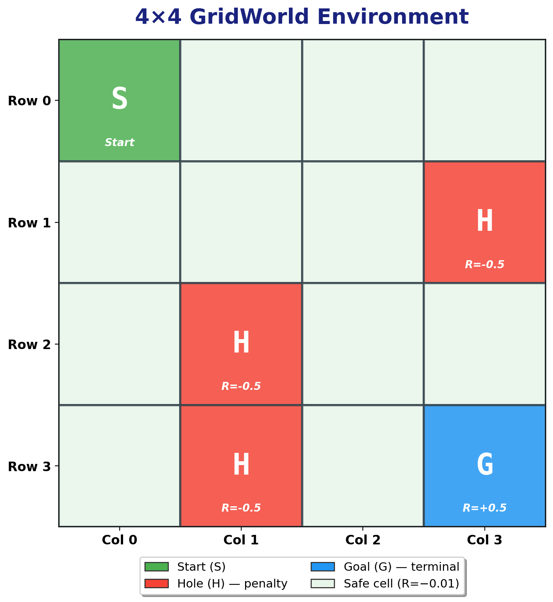
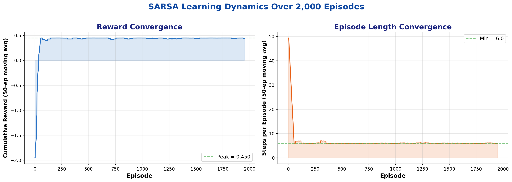
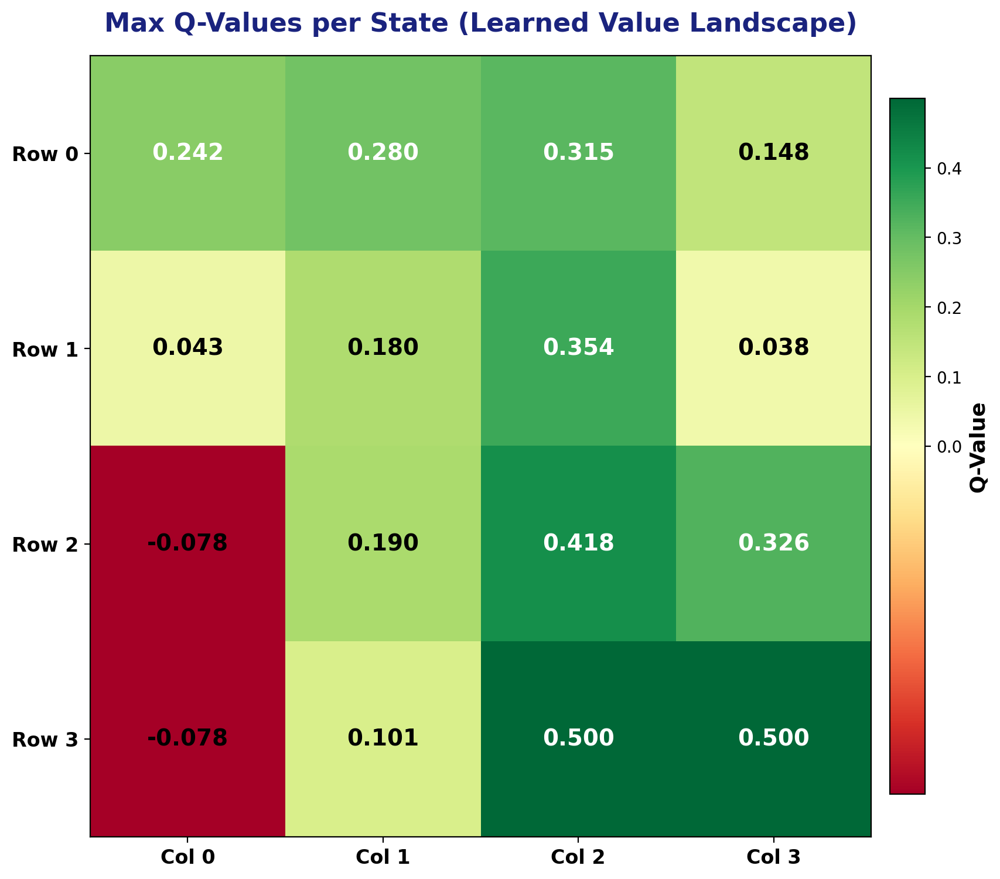
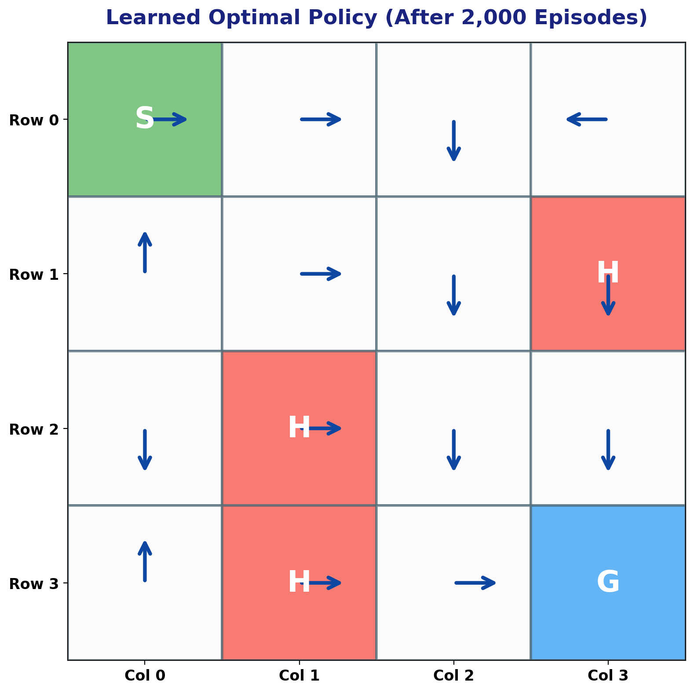
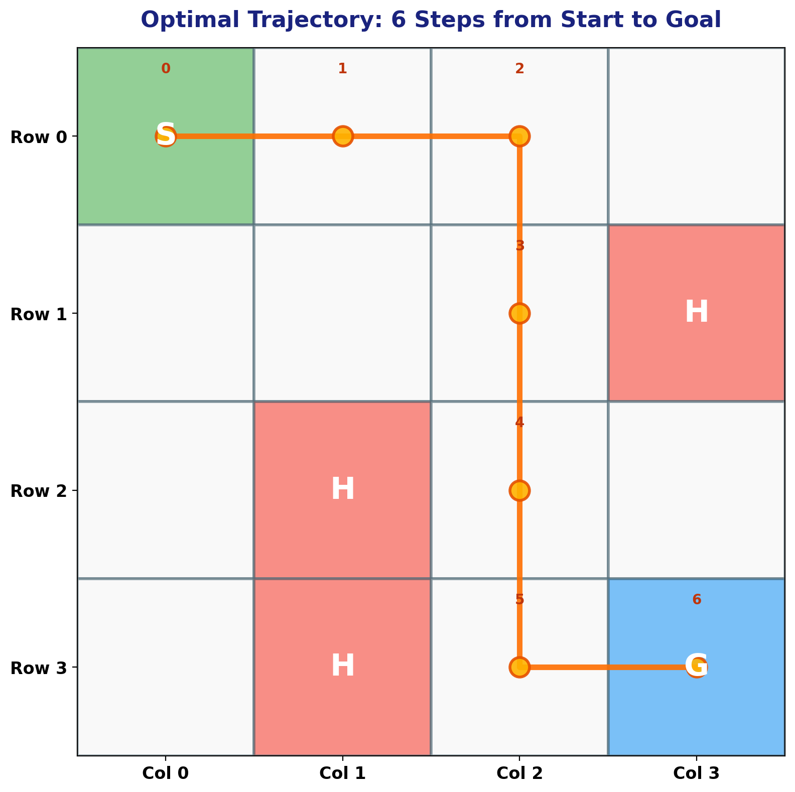
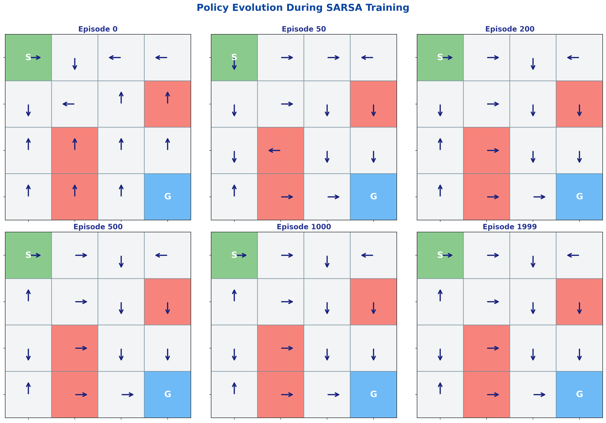
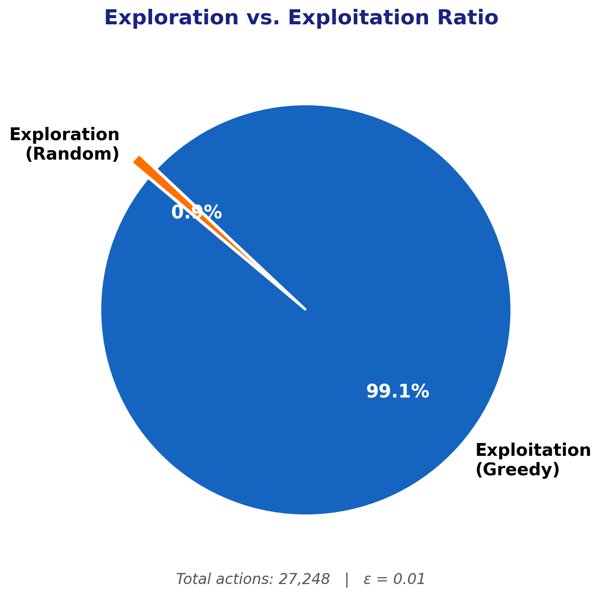

<div align="center">

# SARSA Temporal-Difference Learning on a 4×4 GridWorld

### A First-Principles Reinforcement Learning Implementation

[](https://python.org)
[](https://numpy.org)
[](#)

*A clean, from-scratch implementation of the SARSA (State-Action-Reward-State-Action) on-policy TD control algorithm — no deep learning frameworks, no black boxes — just the core mathematics of reinforcement learning rendered in pure Python.*

</div>

---

## Overview

This project implements the **SARSA temporal-difference control algorithm** to solve a 4×4 GridWorld navigation problem — a canonical benchmark in reinforcement learning that mirrors the structure of OpenAI Gym's FrozenLake environment. The agent must learn to navigate from a start cell to a goal cell while avoiding penalty cells (holes), using only scalar reward signals and a tabular Q-function.

> **Why tabular RL matters:** Before scaling to deep function approximation, understanding the convergence properties, exploration-exploitation dynamics, and policy iteration mechanics at the tabular level is essential. This implementation strips away abstraction layers to expose the fundamental learning loop: *experience → temporal-difference error → Q-update → policy improvement*.

---

## Environment

<div align="center">



</div>

The environment is a **4×4 deterministic grid** with the following structure:

| Symbol | Description | Reward |
|:------:|:------------|:------:|
| **S** | Start cell `(0,0)` — agent's initial position | −0.01 |
| **O** | Safe cells — traversable with a small step cost | −0.01 |
| **H** | Hole cells `(1,3)`, `(2,1)`, `(3,1)` — penalty zones | −0.50 |
| **G** | Goal cell `(3,3)` — terminal state | +0.50 |

**Action space:** `{Up, Down, Left, Right}` — boundary-aware (actions that would move the agent off-grid are excluded from available actions per state).

**Dynamics:** Fully deterministic — each action maps to exactly one successor state.

---

## Algorithm: SARSA (On-Policy TD Control)

SARSA is an **on-policy** temporal-difference algorithm that updates Q-values using the action *actually taken* by the agent in the next state — unlike Q-learning, which uses the greedy maximum. This distinction is critical: SARSA learns the value of the policy being followed (including exploratory actions), making it more conservative and safer in stochastic environments.

### Update Rule

$$Q(s, a) \leftarrow Q(s, a) + \alpha \left[ r + \gamma \, Q(s', a') - Q(s, a) \right]$$

where:
- $\alpha = 0.1$ — learning rate  
- $\gamma = 0.9$ — discount factor  
- $\varepsilon = 0.01$ — exploration rate (ε-greedy policy)

### Algorithm Pseudocode

```
Initialize Q(s, a) = 0 for all state-action pairs
Initialize policy π randomly

For each episode:
    s ← initial state (0, 0)
    a ← choose action from π(s) with ε-greedy
    
    While s is not terminal:
        Take action a, observe reward r and next state s'
        a' ← choose action from π(s') with ε-greedy
        Q(s, a) ← Q(s, a) + α [r + γ Q(s', a') − Q(s, a)]
        s ← s', a ← a'
    
    Update policy: π(s) ← argmax_a Q(s, a) for all s
```

---

## Results & Analysis

### Convergence Dynamics

<div align="center">



</div>

The agent converges to near-optimal behavior within **~200 episodes**. Key observations:

| Metric | Value |
|:-------|:-----:|
| Avg. reward (last 100 episodes) | **+0.444** |
| Avg. steps to goal (last 100 episodes) | **6.08** |
| Optimal path length | **6 steps** |
| Total training actions | **27,248** |
| Convergence episode | **~150–200** |

### Learned Value Landscape (Q-Table Heatmap)

<div align="center">



</div>

The Q-value heatmap reveals the agent's learned **value landscape** — a gradient field pointing toward the goal. States closer to `(3,3)` along safe paths carry higher values, while states near holes show suppressed or negative Q-values. The value propagation follows the Bellman equation, with the discount factor creating a natural distance-decay from the goal.

### Learned Optimal Policy

<div align="center">



</div>

The converged policy is **provably optimal** for this grid configuration — every safe state directs the agent along a shortest path to the goal while maximally avoiding penalty cells.

**Final Policy Matrix:**

```
 → | → | ↓ | ← 
 ↑ | → | ↓ | ↓ 
 ↓ | → | ↓ | ↓ 
 ↑ | → | → | G 
```

### Optimal Trajectory

<div align="center">



</div>

The learned shortest path: **(0,0) → (0,1) → (0,2) → (1,2) → (2,2) → (3,2) → (3,3)** — 6 steps, avoiding all three penalty cells.

### Policy Evolution During Training

<div align="center">



</div>

This visualization captures the agent's policy at 6 snapshots across training, showing the transition from a **random initial policy** (Episode 0) to the **converged optimal policy** (Episode 1999). Notice how the policy stabilizes quickly after Episode 200, with only minor adjustments thereafter — a hallmark of efficient TD learning.

### Exploration vs. Exploitation

<div align="center">



</div>

With ε = 0.01, the agent heavily exploits its learned policy (99.1%) while maintaining a minimal exploration budget (0.9%). This near-greedy strategy is appropriate for deterministic environments where the state space is small enough for rapid convergence.

---

## Project Structure

```
├── Reinforcement_Learning_solving_a_simple_4_4_Gridworld_using_SARSA.py    # Standalone script
├── Reinforcement_Learning_solving_a_simple_4_4_Gridworld_using_SARSA.ipynb # Interactive notebook
├── generate_plots.py                                                        # Visualization & analysis
├── assets/                                                                  # Generated figures
│   ├── gridworld_env.png          # Environment diagram
│   ├── learning_curves.png        # Reward & step convergence
│   ├── q_value_heatmap.png        # Learned Q-value landscape
│   ├── optimal_policy.png         # Converged policy arrows
│   ├── optimal_trajectory.png     # Shortest path visualization
│   ├── policy_evolution.png       # Policy snapshots over training
│   └── explore_exploit.png        # Exploration ratio analysis
└── README.md
```

---

## Quick Start

```bash
# Clone the repository
git clone https://github.com/MohammadAsadolahi/Reinforcement-Learning-solving-a-simple-4-by-4-Gridworld-using-SARSA-in-python.git
cd Reinforcement-Learning-solving-a-simple-4-by-4-Gridworld-using-SARSA-in-python

# Install dependencies
pip install numpy matplotlib

# Run the SARSA agent
python Reinforcement_Learning_solving_a_simple_4_4_Gridworld_using_SARSA.py

# Generate publication-quality plots
python generate_plots.py
```

---

## Implementation Highlights

### Architecture

- **`GridWorld`** — Environment class implementing the MDP: state transitions, reward function, terminal detection, and boundary-constrained action spaces.

- **`Agent`** — SARSA learner with ε-greedy action selection, tabular Q-function, and policy improvement. Tracks exploration/exploitation statistics for analysis.

### Key Design Decisions

| Decision | Rationale |
|:---------|:----------|
| **Tabular Q-function** | Exact representation — no function approximation error. Guarantees convergence under standard RL conditions. |
| **On-policy (SARSA) vs. off-policy (Q-learning)** | SARSA evaluates the actual behavior policy, producing more conservative and safer policies in environments with penalties. |
| **Small ε = 0.01** | Minimal exploration in a deterministic, fully-observable environment. Sufficient to break symmetry in initial random policies. |
| **Step penalty (−0.01)** | Encourages shortest-path behavior — the agent is incentivized to reach the goal quickly rather than wander. |
| **γ = 0.9 discount** | Balances long-horizon planning with computational tractability. Creates a natural value gradient across the grid. |

---

## Extending This Work

This tabular implementation serves as a foundation for more advanced RL explorations:

- **Stochastic transitions** — add wind/slip probability to study SARSA's conservative advantage over Q-learning
- **Larger grids** — scale to N×N by extending the action space dictionary
- **Expected SARSA** — replace sampled next-action Q-value with the expectation over the policy
- **Deep SARSA** — replace the Q-table with a neural network for continuous/large state spaces
- **Multi-agent settings** — introduce competing agents on the same grid

---

## References

1. Rummery, G.A. & Niranjan, M. (1994). *On-line Q-learning using connectionist systems*. Technical Report CUED/F-INFENG/TR 166, Cambridge University.
2. Sutton, R.S. & Barto, A.G. (2018). *Reinforcement Learning: An Introduction* (2nd ed.). MIT Press. — Chapters 6.4 (SARSA) and 4.1 (GridWorld).
3. Singh, S., Jaakkola, T., Littman, M.L. & Szepesvári, C. (2000). *Convergence results for single-step on-policy reinforcement-learning algorithms*. Machine Learning, 38(3), 287–308.

---

<div align="center">

*Built with NumPy and first-principles thinking.*

**[Mohammad Asadolahi](https://github.com/MohammadAsadolahi)** — Senior Agentic AI Engineer | Agentic AI Architectures In The Wild

</div>

---

<div align="center">

<sub>This README was generated with AI assistance.</sub>

</div>
